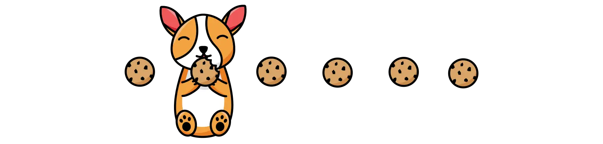

# CorgiScroll

CorgiScroll is a tiny library that adds clickable pagination to CSS Scroll Snap sliders. Just choose which elements to apply, and you're away! 




## Installation
To get started you can either 
- Use the CDN link and put it before the ending `body` tag
- Import it into your project with npm
- Copy the `corgiscroll.min.js` file straight into your project 

```js
import CorgiScroll from 'netoka/corgiscroll'
```

## Usage
CorgiScroll needs a container element to know what to watch. You need to pass in the direct parent of the slides. Let's pretend we have this markup:

```html
<div id="slider">
    <div> A stylish slide</div>
    <div> A slightly more stylish slide</div>
</div>
```

Now, initialise CorgiScroll
```js
new CorgiScroll( document.querySelector('#slider'))
``` 


### Options 
CorgiScroll doesn't currently have any options available :(